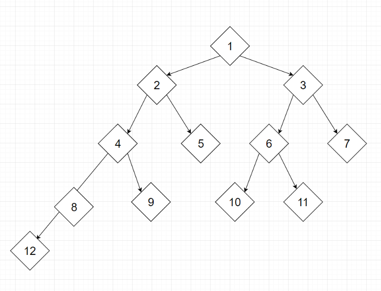
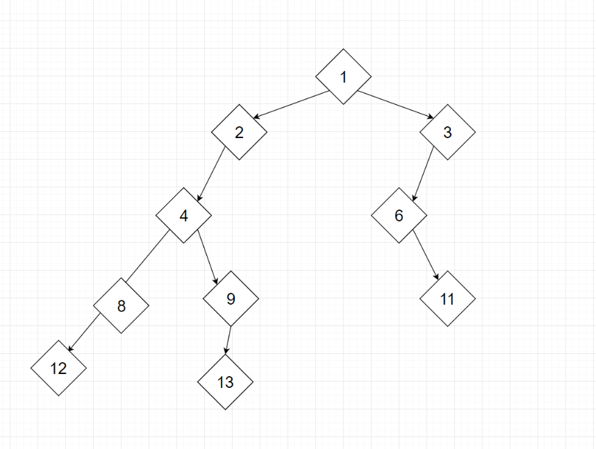
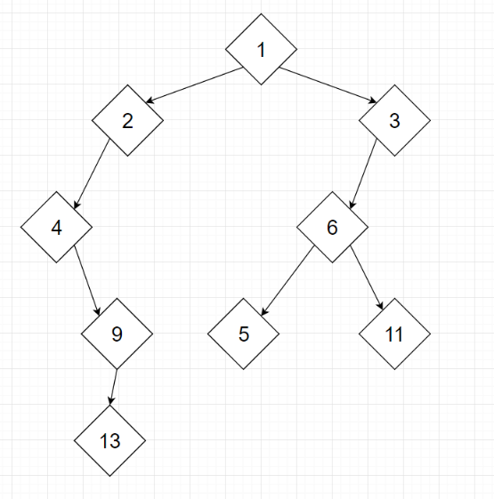
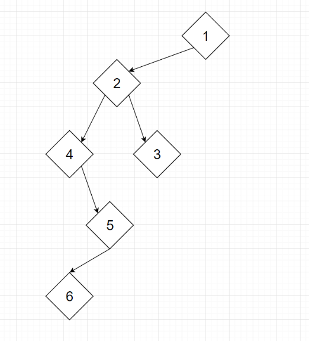
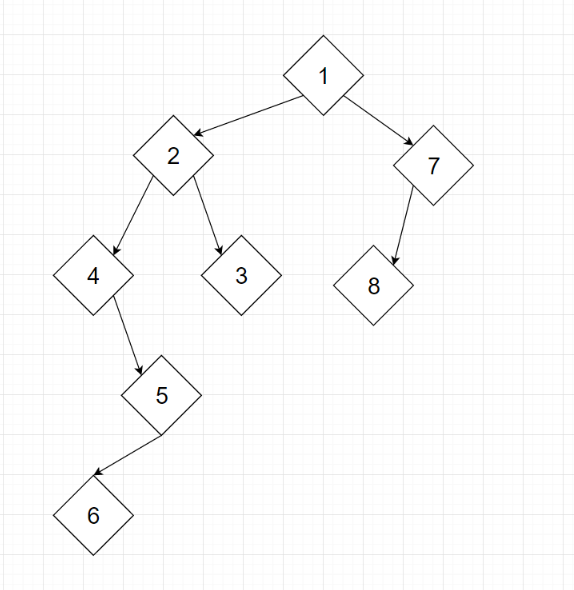

# 5 Arbori si parcurgerea log

## Arborele 1

* Parcurgerea in inordine (stanga –varf – dreapta SVD) – 12 8 4 9 2 5 1
* Parcurgerea in preordine  (varf- stanga – dreapta VSD) -
* Parcurgerea in postordine (stanga – dreapta – varf SDV) -

## Arborele 2

* Parcurgerea in inordine (stanga –varf – dreapta SVD) – 
* Parcurgerea in preordine  (varf- stanga – dreapta VSD) -
* Parcurgerea in postordine (stanga – dreapta – varf SDV) -
## Arborele 3

* Parcurgerea in inordine (stanga –varf – dreapta SVD) – 
* Parcurgerea in preordine  (varf- stanga – dreapta VSD) -
* Parcurgerea in postordine (stanga – dreapta – varf SDV) -
## Arborele 4

* Parcurgerea in inordine (stanga –varf – dreapta SVD) – 
* Parcurgerea in preordine  (varf- stanga – dreapta VSD) -
* Parcurgerea in postordine (stanga – dreapta – varf SDV) -
## Arborele 5

* Parcurgerea in inordine (stanga –varf – dreapta SVD) – 
* Parcurgerea in preordine  (varf- stanga – dreapta VSD) -
* Parcurgerea in postordine (stanga – dreapta – varf SDV) -